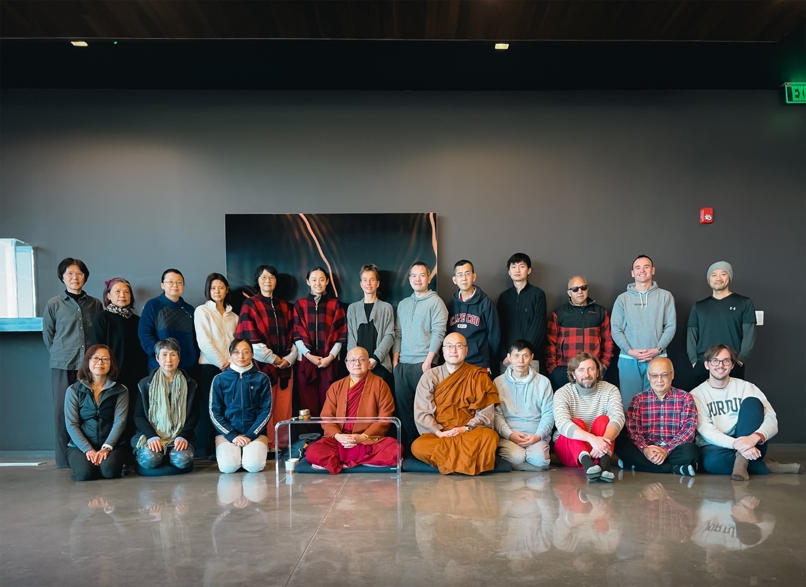

I was born into a small town in Indiana in the year 2000. For the first 8 years of my life I was homeschooled, so that I could travel all over the world with my parents. Eventually, my parents decided that my sister and I needed more structured learning, so in fourth grade, they enrolled us in the International School of Indiana. There I developed my love of math, computing, and physics. After high school, I enrolled in the Purdue University Honors Engineering program with ambitions of becoming an aerospace engineer. After learning that my passion wasn't in the field of aerospace, I switched majors a few times until I landed on Economics. During my time at Purdue I was a TA for Computational Economics, and a research assistant in the experimental economics laboratory. I graduated with honors, a B.S. in Economics and a minor in mathematics. Wanting to pursue software deeper at the end of college, and I picked up a job with [Counterpart](https://counterpart.biz) upon graduating as a project manager and developer. I live with my beautiful fiancee in the San Francisco Bay Area.

# Some of my interests

## Buddhism

One day, while scrolling YouTube, I came across a guided mediation by the late zen master [Thich Nhat Hanh](https://plumvillage.org/about/thich-nhat-hanh). It was only about 20 minutes, but sitting in that silence, being with reality, had a deep effect on me. Walking to a club meeting after that session was transformative, I felt connected with the wind against my skin, the play of colors on the sidewalk, the moisture of my mouth. Having experienced depression through college, for the first time I saw something beyond the pen in my mind in which I'd been running.

If you're new to Buddhist philosophy, it studies how suffering can be transformed through practices of deeply connecting with reality. It was started by an ancient Indian prince, Siddhartha Gautama, who, according to legend, renounced his royalty to learn how to achieve freedom from unhappiness. He initially sought out forest-dwelling spiritual teachers (who he quickly outgrew), eventually setting off on his own path. After years of practice, on a fateful night, sitting in meditation, they say he solved the riddle, setting off a groundbreaking paradigm shift in his mind. For the rest of his life he wandered India, forming a large spiritual community of monks and nuns, dedicating himself towards aiding all living beings in healing their stress, anxiety, and suffering.

Throughout the year I go to week long meditation retreats at [Amatavihara](https://uszen.org), a meditation center in Boyds, Maryland, with my fiancee.

*(That's me in the bottom right with the Purdue sweatshirt!)*

## Music

Towards the end of high school I started writing songs on my guitar, getting into piano as well in college. There is something deeply wonderful in music. I love music where you can feel the soul of the artist, where it's clear they have a deep connection to the art they are making. Music like this lifts my heart, reconnects me with the joy of the life that I'm living.

### Some of my favorite songs
- [Youth - Portico Quartet](https://www.youtube.com/watch?v=B-FWhcNvNhA&list=PL0fnQ-D1gxK619nNLoAKk12aTL1EMBLOJ&index=1)
- [Peace Piece - Bill Evans](https://www.youtube.com/watch?v=Nv2GgV34qIg&list=PL0fnQ-D1gxK619nNLoAKk12aTL1EMBLOJ&index=4)
- [Gracias a La Vida - Mercedes Sosa](https://www.youtube.com/watch?v=cIrGQD84F1g&list=PL0fnQ-D1gxK619nNLoAKk12aTL1EMBLOJ&index=5)
- [Present Tense - Radiohead](https://www.youtube.com/watch?v=6hgVihWjK2c&list=PL0fnQ-D1gxK619nNLoAKk12aTL1EMBLOJ&index=7)
- [Do You Realize? - Plum Village Cover](https://www.youtube.com/watch?v=Hjs54uVkkoE&list=PL0fnQ-D1gxK619nNLoAKk12aTL1EMBLOJ&index=6)
- [Will You Go Lassie Go - Joan Baez](https://www.youtube.com/watch?v=zr9C_R2UM20&list=PL0fnQ-D1gxK619nNLoAKk12aTL1EMBLOJ&index=9)
- [Unison - Bjork](https://www.youtube.com/watch?v=9PEybjgUj6U)
- [It's In Our Hands - Bjork](https://www.youtube.com/watch?v=nWoEITAoYE8)
- [Vesna - DakhaBrakha](https://www.youtube.com/watch?v=AObDpJ6xQMk)

## Computing
### Emacs

Emacs is the first piece of software that I've stood in pure reverence of. So many of its ideas continue to be extremely innovative. It's a fully transparent, fully extensible piece of software. A Turing complete environment for getting anything and everything done. All built on top of a variant of lisp, a family of languages that are in and of themselves rich with brilliant ideas of how we should be writing code.

I love using Emacs so much that I moved my website to be entirely managed in [Org Mode](https://orgmode.org/). The text you're reading was generated from within Emacs using a customized Org Mode to HTML exporter I wrote in [elisp](https://www.gnu.org/software/emacs/manual/html_node/elisp/)!
