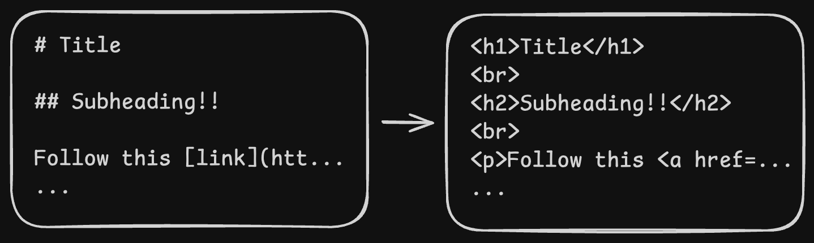

[FastHTML](https://fastht.ml/) is one my favorite things happening in the web world right now. If we haven't seen it before, it's powered by what are called "fast tags"; implementations of every HTML tag as Python functions. Since we can pass python strings as arguments into fast tags, we can quickly hack together a templating system for whatever website we're building. The system becomes very powerful when paired with a web server that can leverage fast tags in responding to HTTP requests. It becomes extraordinarily powerful when paired with a JavaScript library like [htmx](https://htmx.org), allowing we to build fully interactive applications just from wer server rendered HTML.

Let's take a look at a simple example first

```python
from fasthtml.common import *

app, router = fast_app()

# When the server gets a HTTP GET
# request, execute the function Index
# Return the output of that function
# as the body of the server's response
@app.get('/')
def Index():
	return Div("Hello, world!")

serve()
```

When we run this program, it will spin up a web server on `localhost:5001`

```bash
curl localhost:5001
```

```html
<!doctype html>
<html>
<head>
    <title>FastHTML page</title>
    <meta charset="utf-8">
    <meta name="viewport" content="width=device-width, initial-scale=1, viewport-fit=cover">
    <script src="https://unpkg.com/htmx.org@2.0.4/dist/htmx.min.js"></script>
    <script src="https://cdn.jsdelivr.net/gh/answerdotai/fasthtml-js@1.0.12/fasthtml.js"></script>
    <script src="https://cdn.jsdelivr.net/gh/answerdotai/surreal@main/surreal.js"></script>
    <script src="https://cdn.jsdelivr.net/gh/gnat/css-scope-inline@main/script.js"></script>
    <link rel="stylesheet" href="https://cdn.jsdelivr.net/npm/@picocss/pico@latest/css/pico.min.css">
    <style>
        :root {
            --pico-font-size: 100%;
        }
    </style>
</head>
<body>
    <div>Hello, world</div>
</body>
</html>
```

Great! Our `body` tag looks right, we have our hello world. One thing to note is that FastHTML includes a bunch of tags in the header that we don't necessarily want. By default, it includes:

- `htmx` for making interactive server side rendered apps
- `pico.css` for nice default styling
- `surreal.js` for conveniences when writing other javascript
- `fasthtml.js` for other defaults

Thankfully, these defaults can be disabled.

```python
# ...
app, router = fast_app(default_hdrs=False)
# ...
```

```bash
curl localhost:5001
```

```html
 <!doctype html>
 <html>
   <head>
     <title>FastHTML page</title>
   </head>
   <body>
     <div>Hello, world</div>
   </body>
 </html>
```

Beautiful! A blank canvas.

Now, we can start building custom templates that take arguments.

```python
def TitleSection(title: str, subtitle: str):
    return Div(
        H1(title),
        H2(subtitle)
    )

@app.get('/')
def Index():
    return TitleSection(
        title="In the Beginning...",
        subtitle="A history of beginnings"
    )
```

```html
 <!doctype html>
 <html>
   <head>
     <title>FastHTML page</title>
   </head>
   <body>
     <div>
       <h1>In the Beginning...</h1>
       <h2>A history of beginnings</h2>
     </div>
   </body>
 </html>
```

One of the great features of FastHTML is that we can define any HTML tag attributes we normally would by leveraging Python keyword arguments. This means that we can create custom classes and modify the `class` of our HTML elements. Anything passed into a fast tag as a keyword argument will be rendered as an attribute on the HTML element.

Let's add some CSS to our HTML header, and style our elements.

```python
app, router = fast_app(
    default_hdrs=False,
    hdrs=(
        Style('''
            .title {
              font-size: 24px;
              font-weight: bold;
            }
            .subtitle {
              font-size: 18px;
              color: #666;
            }
        '''),
    )
)

def TitleSection(title: str, subtitle: str):
    return Div(
        H1(title, cls="title"),
        H2(subtitle, cls="subtitle", data_custom="random custom attribute")
    )

@app.get('/')
def Index():
    return TitleSection(
        title="In the Beginning...",
        subtitle="A history of beginnings"
    )
```

```html
<!doctype html>
<html>
<head>
    <title>FastHTML page</title>
    <style>
        .title {
            font-size: 24px;
            font-weight: bold;
        }

        .subtitle {
            font-size: 18px;
            color: #666;
        }
    </style>
</head>
<body>
    <div>
        <h1 class="title">In the Beginning...</h1>
        <h2 data-custom="random custom attribute" class="subtitle">A history of beginnings</h2>
    </div>
</body>
</html>
```

Notice the `data-custom` attribute on our `h2` element!

FastHTML is simple, but ridiculously flexible. It's an engine that produces HTML in response to HTTP requests, and it does it really really well. FastHTML brings the functional templating style of `JSX` to Python.

# Bringing in the Modern Web

Okay, generating HTML is useful, but modern web apps are much more than just handwritten HTML. If we're like me, when building a web app we want to use Tailwind and a component library. Let's explore how to make that work in our FastHTML application.

## Integrating Tailwind

The easiest way to work with Tailwind in our project is to use the `npm` package, which means setting up an `npm` environment for our installation of `@tailwindcss/cli`. Docs for how to do this are easily accessible on Tailwind's [website](https://Tailwindcss.com/docs/installation/Tailwind-cli). 

Once running the install command for npm, we need to do a few more things for setup:

- Create a `styles.css` file in a folder called `css` in our project's root directory. In that file add an import for our application to use Tailwind.

```css
@import "tailwindcss";
```

- Next, create a file called `Tailwind.config.js` for configuring Tailwind. In this config, we ask Tailwind to scan our python files for Tailwind classes. One of the cool parts of Tailwind is that it doesn't necessarily need to operate on HTML. Tailwind relies on keyword matching, and some simple heuristics, to determine if the files it is scanning contain Tailwind classes.

```js
module.exports = {
  content: ['./**/*.py'],
  theme: {
    extend: {},
  },
  corePlugins: {
    margin: true,  // Explicitly enable margin utilities
  },
  plugins: [],
}
```

- Once Tailwind is configured, we can generate our initial compiled css file using Tailwind. In my project, I'm compiling it to a `styles.css` file in an `assets` folder. In the `assets` folder I also store images/vector graphics. The below command will generate those styles.

```bash
npx @tailwindcss/cli -i ./css/styles.css -o ./assets/styles.css
```

- Finally, in our `main.py`, we configure FastHTML to generate HTML which pulls in our generated css.

```python
# ...
app, router = fast_app(
	default_hdrs=False
    hdrs=(
        Link(rel='stylesheet', href="./assets/styles.css", type='text/css'),
	)
)
# ...
```

Below is a rough outline of our new project file structure

```bash
website/
├── css
│   └── styles.css
├── assets
│   └── styles.css
├── main.py
├── package.json
└── tailwind.config.js
```

## Leveraging Franken UI

[Franken UI](https://franken-ui.dev/docs/2.0/installation) offers a fantastic collection of components that seamlessly work with Tailwind projects. Franken UI is great for FastHTML because it's designed from the ground up to work without any web frameworks.

Getting it set up in our project is very simple, just involves referencing some CDN documents in our HTML headers.

```python
# ...
app, router = fast_app(
	default_hdrs=False
    hdrs=(
        Link(rel='stylesheet', href="./assets/styles.css", type='text/css'),
		Link(rel='stylesheet', href="https://unpkg.com/franken-ui@2.0.0/dist/css/core.min.css", type='text/css'),
        Script(src="https://unpkg.com/franken-ui@2.0.0/dist/js/core.iife.js", type="module"),
        Script(src="https://unpkg.com/franken-ui@2.0.0/dist/js/icon.iife.js", type="module"),
	)
)
# ...
```


# Writing articles in Markdown

Writing articles in markdown is much more convenient than writing them in HTML, mainly because there are a number of great graphical editors for markdown. To make markdown files work in our system, we need to take our markdown text, convert it into HTML, and configure our web server to serve it.

Here's how I handle it on this website at a high level:

- Markdown files are stored in a folder called `articles` 

```bash
articles
├── about.md
├── ai-copyright.md
├── engineer-solutions.md
├── fasthtml.md
├── fossora.md
├── lisp-machines.md
├── monads.md
├── professional-work.md
├── raft-kubernetes.md
├── search-engine.md
└── stargate-agi.md
```

- When the server starts, it looks in the articles folder, reads some `YAML` frontmatter included in each markdown file, generates HTML, and stores each article as an in-memory object.
- The server registers that HTML response to an endpoint corresponding to the article's filename (without the `.md` extension)

## Implementation details

To parse markdown, and `YAML` frontmatter, I use the `markdown` and `python-frontmatter` packages.

Parsing and conversion is very straightforward

Here's the start of this article as markdown for reference.

```markdown
---
title: How FastHTML Powers this Website
artist: tony etienne
hero: https://cdnb.artstation.com/p/assets/images/images/023/659/429/4k/tony-etienne-more-brains-in-jars-001.jpg?1579916139
artist-page: https://www.artstation.com/plongitudes
date: 2025-03-06
visible: true
tags:
  - swe
---
[FastHTML](https://fastht.ml/) is probably one of the most exciting things happening...
```

And here's the startup code in `main.py` that parses and prepares all the articles. In the snippet below, I parse all the markdown files and create a bunch of `article`  objects that have `content` (html), and `url` properties. These objects also have properties corresponding to each of the key value pairs defined in the frontmatter. This means they have properties like `title`, `hero`, etc.

```python
article_names = os.listdir('articles')
md = markdown.Markdown()
articles = []

for article_name in article_names:
	# ignores folders created on purpose/accidentally
	# in the 'articles' folder
    path = os.path.join('articles', article_name)
    if os.path.isdir(path):
        continue

    with open(path, 'r') as article:
        article = frontmatter.load(article)
        article.content = md.convert(article.content)
        article['url'] = article_name.split('.')[0]
        articles.append(article)
```

Next, these articles are registered with the web server by pairing them with a FastHTML function for generating HTML based on that object.

```python
def PostPage(article):
    return Title(article['title']), Post(article)

def create_article_handler(article_obj):
    def handler():
        return PostPage(article_obj)
    return handler

for article in articles:
    app.get('/'+article['url'])(create_article_handler(article))
```

# Why I'm Excited About this Architecture

Because all of the articles are stored as objects in memory, I can use that data to drive other parts of the site. The landing page for this site uses that list of articles to dynamically generate the grid of links. In the future, I could easily add other features for searching over articles, or dynamically generate pages that organize articles by tag. I can do all my writing in [Obsidian](https://obsidian.md/), and the site will dynamically update itself to serve my new articles without manual intervention.

If we want to reference the nitty gritty of the internals of this site, this entire site is open source on my [GitHub](https://github.com/Sawyer-Powell/personal-website-v2/tree/main).